# stay.io

[](http://github.com/sudiptog81/stay.io/blob/master/LICENSE.md "The MIT Open-Source License")
[](https://travis-ci.com/github/sudiptog81/stay.io "CI Build Status")
[](https://github.com/sudiptog81/stay.io/actions?query=workflow%3A%22Tests+Workflow%22 "GitHub Tests Workflow")
[](https://github.com/sudiptog81/stay.io/actions?query=workflow%3A%22Build+Workflow%22 "GitHub Build Workflow")
[](https://david-dm.org/sudiptog81/stay.io?path=backend "Backend Dependencies")
[](https://david-dm.org/sudiptog81/stay.io?path=frontend "Frontend Dependencies")

stay.io is a simple, scalable and containerized rating application.

It features role-based access to add, edit, delete, view, like, rate and comment on listings posted by providers who are able to add, edit, and delete their own listings and have all features that a normal unprivileged user would have. A normal user is able to only like, rate and comment on listings. They are also able to edit and delete their profiles.

The frontend application is built on Vue.js and the backend is a JWT-authenticated RESTful JSON API that communicates with a Postgresql database. Authentication is cookie-based and leverages cookie-handling by Passport.js.

The application is available to be deployed in a multi-container deployment according to the `docker-compose.yml` file in the repository.

[View CI Build Status](http://travis-ci.com/github/sudiptog81/stay.io)

[View GitHub Workflows](https://github.com/sudiptog81/stay.io/actions)

## Quick Start

Set up a VirtualHost in your web server that points to the backend of the application.

```nginx
server {
  listen 80;
  server_name <your-domain>
  location / {
    proxy_pass http://localhost:5002/;
  }
}
```

Replace the temporary API endpoint with `<your-domain>` in `frontend/src/api/config.js`.

Add a Facebook API Secret in `.env` as `FB_API_SECRET=<your-secret>`

Use `docker-compose` as the container orchestrator to spin up all required services. The command that is to be executed is given below.

```bash
sudo docker-compose -f docker-compose.yml up \
                    -d --build frontend &
```

The `docker-compose.yml` in the root of the repository exposes various aspects of the application at the given ports.

- `5001` - Database (postgresql)
- `5002` - Backend APIs
- `5003` - Frontend served via NGINX

## Technologies

### Backend ExpressJS REST API

- [bcrypt](https://en.wikipedia.org/wiki/Bcrypt)
- [express](https://expressjs.com/)
- [passport](http://www.passportjs.org/)
- [sequelize](https://sequelize.org/)
- [postgresql](https://www.postgresql.org/)
- [jsonwebtoken](https://jwt.io/)

### Frontend Reactive Web Application

- [vue](https://vuejs.org/)
- [vuex](https://vuex.vuejs.org/)
- [axios](https://github.com/axios/axios)
- [moment](https://momentjs.com/)
- [vuetify](https://vuetifyjs.com/en/)
- [vuelidate](https://vuelidate.js.org/)
- [vue-router](https://router.vuejs.org/)
- [vue-toasted](https://github.com/shakee93/vue-toasted)
- [bootstrap-vue](https://bootstrap-vue.org/)

### Unit Testing

- [jest](https://jestjs.io/)
- [supertest](https://github.com/visionmedia/supertest)

### CI/CD Pipelines

- [travis-ci](https://travis-ci.com/)
- [github-workflows](https://help.github.com/en/actions/configuring-and-managing-workflows)

### Deployment

- [nginx](https://www.nginx.com/)
- [docker](https://www.docker.com/)
- [docker-compose](https://github.com/docker/compose)

## Development

Clone this repository on your machine.

Install all required dependencies in `backend` and `frontend` directories by executing `npm install` in both directories. Install the `@vue/cli` package globally by executing `sudo npm i -g @vue/cli`.

Tests can be run in `backend` and `frontend` directories by executing `npm test` in either one of them for triggering the respective test suites.

## API Reference

The REST API Documentation is hosted at [SwaggerHub](https://app.swaggerhub.com/apis-docs/sudiptog81/stay.io/1.0.0).

## License

The MIT Open-Source License

## Screenshots

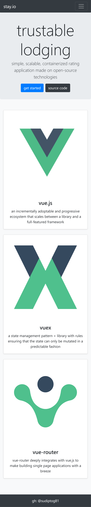
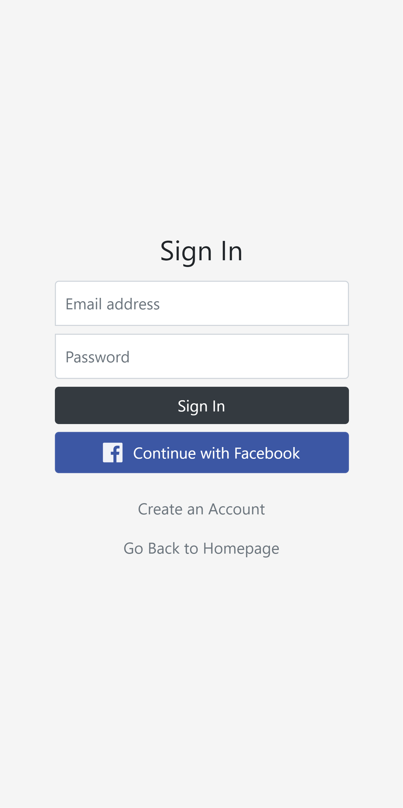
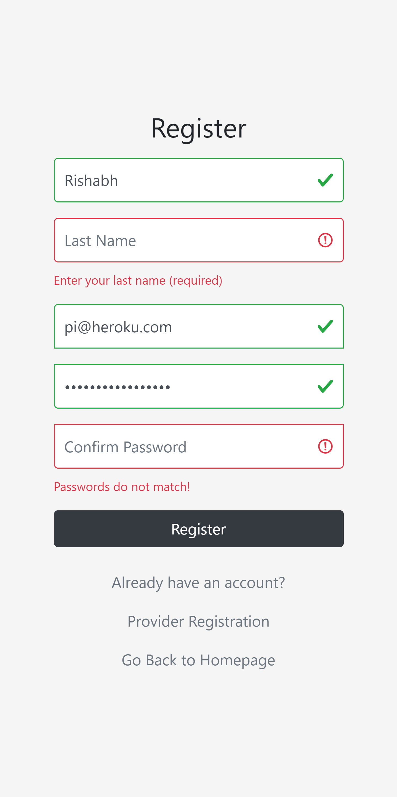
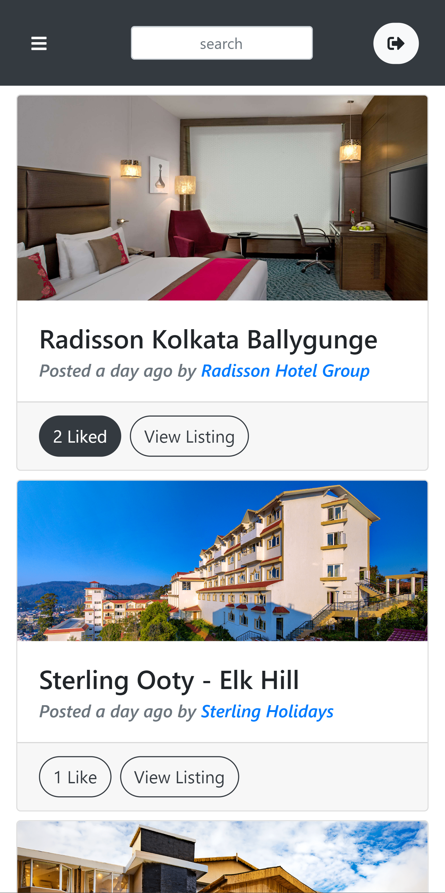


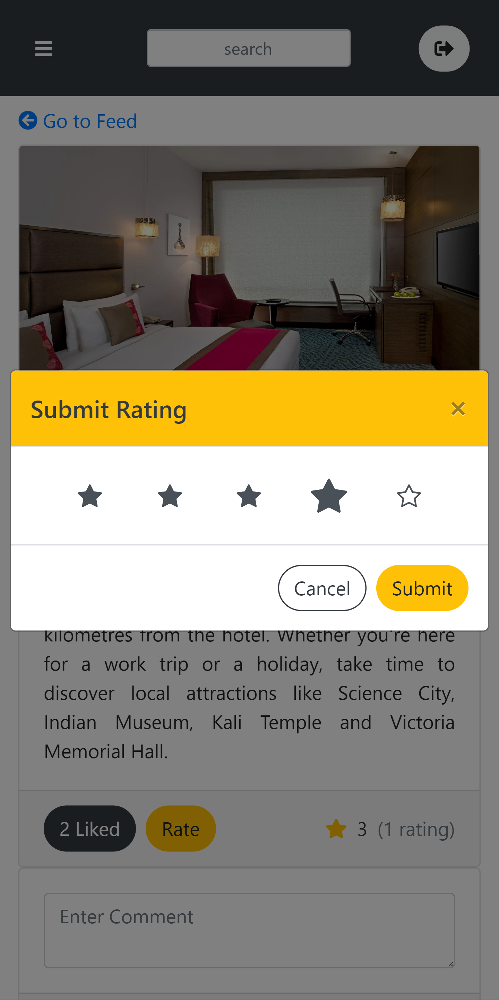
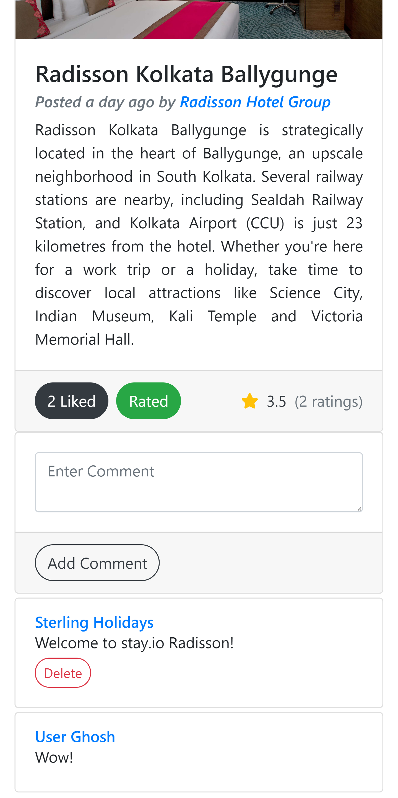
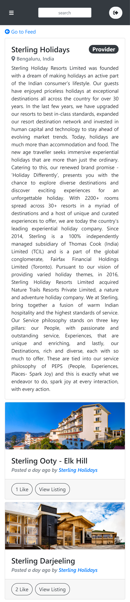
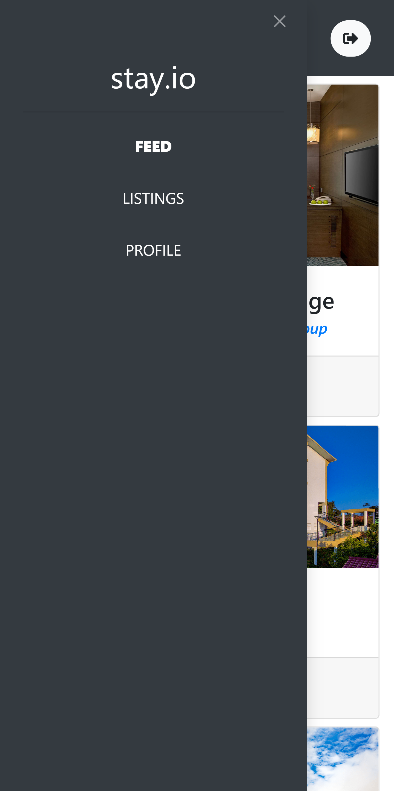
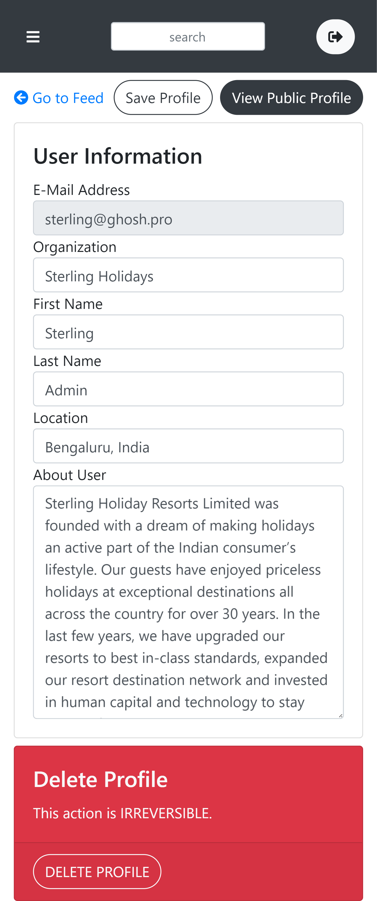
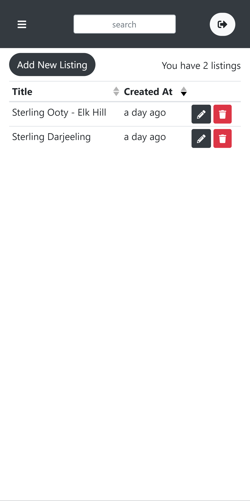
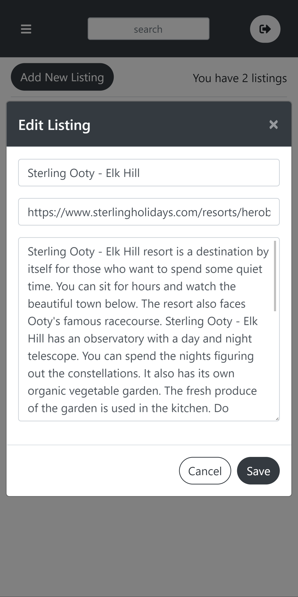
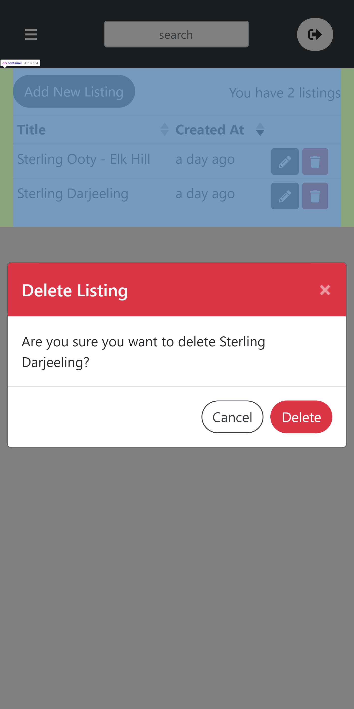
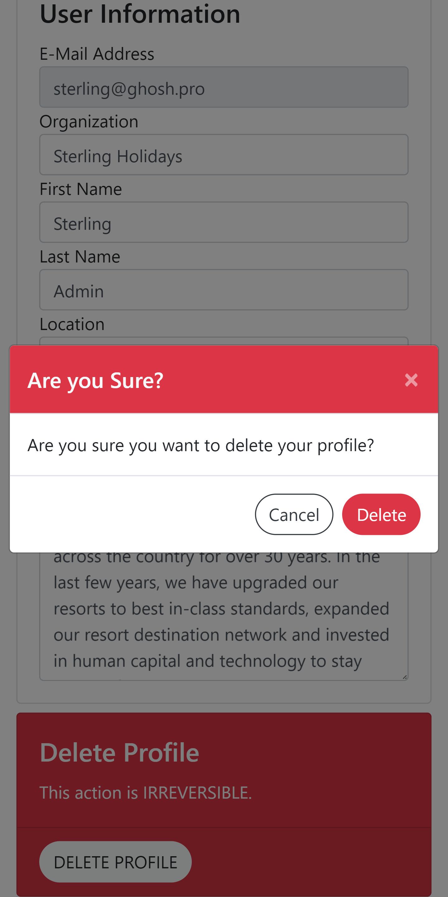
